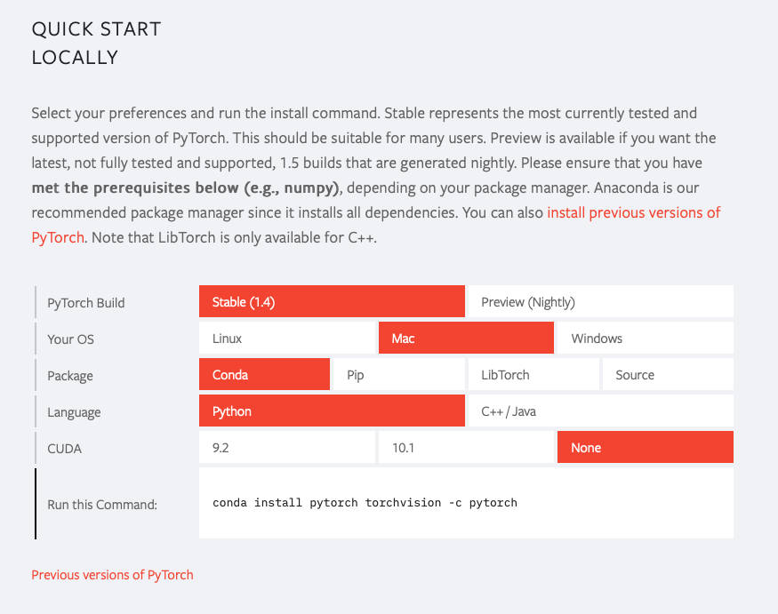
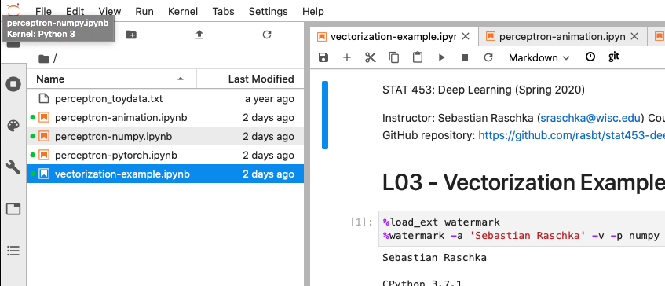

Sebastian Raschka, 2020

# Installing Python Packages

Python is available for all three major operating systems — Microsoft Windows, macOS, and Linux — and the installer, as well as the documentation, can be downloaded from the official Python website: https://www.python.org.

In this class, I am using Python `3.7.1`, and it is recommended you use it as well. Python 3.6 and Python 3.8 are also okay (PyTorch just added Python 3.8 support [in PyTorch 1.4 a few weeks ago, in Jan 2020.](https://github.com/pytorch/pytorch/releases/tag/v1.4.0))

**Please do not use Python 2.7. [Python 2.7 has been discontinued this year, in 2020](https://www.python.org/doc/sunset-python-2/) and code may not work or produce unexpected results.**

**Note**

You can check your current default version of Python by executing

    $ python -V

In my case, it returns

    Python 3.7.1 :: Continuum Analytics, Inc.

#### Pip

The additional packages that we will be using throughout this book can be installed via the `pip` installer program, which has been part of the Python standard library since Python 3.3. More information about pip can be found at https://docs.python.org/3/installing/index.html.

After we have successfully installed Python, we can execute pip from the command line terminal to install additional Python packages:

    pip install SomePackage

(where `SomePackage` is a placeholder for numpy, pandas, matplotlib, scikit-learn, and so forth).

Already installed packages can be updated via the `--upgrade` flag:

    pip install SomePackage --upgrade

#### Anaconda/Miniconda

A highly recommended alternative Python distribution for scientific computing
is Anaconda by Continuum Analytics. Anaconda is a free—including commercial use—enterprise-ready Python distribution that bundles all the essential Python packages for data science, math, and engineering in one user-friendly cross-platform distribution. The Anaconda installer can be downloaded at https://docs.anaconda.com/anaconda/install/, and an Anaconda quick start-guide is available at https://docs.anaconda.com/anaconda/user-guide/getting-started/.

After successfully installing Anaconda, we can install new Python packages using the following command:

    conda install SomePackage

Existing packages can be updated using the following command:

    conda update SomePackage

Throughout this course, we will mainly use NumPy's multi-dimensional arrays to store and manipulate data as well as PyTorch for deep learning. Occasionally, we will make use of pandas, which is a library built on top of NumPy that provides additional higher level data manipulation tools that make working with tabular data even more convenient. To augment our learning experience and visualize quantitative data, which is often extremely useful to intuitively make sense of it, we will use the very customizable matplotlib library.

(Personally, I prefer Miniconda, which is similar to Anaconda, but comes with fewer packages out of the box. Hence, it's a bit smaller and doesn't come with packages that you may not need. On the other hand, you have to install all packages yourself, which is a bit more extra work.)

#### Core packages

The version numbers of the major Python packages that we will use in this course  are listed below. Please make sure that the version numbers of your installed packages are equal to, or greater than, those version numbers to ensure the code examples run correctly:

- [NumPy](http://www.numpy.org) >= 1.17.4
- [SciPy](http://www.scipy.org) >= 1.3.1
- [scikit-learn](http://scikit-learn.org/stable/) >= 0.22.0
- [matplotlib](http://matplotlib.org) >= 3.1.0
- [pandas](http://pandas.pydata.org) >= 0.25.3

## Installing PyTorch

Installing PyTorch is a bit "special" -- here, I do not recommend *just* using `conda` or `pip` to install it. Instead, please visit the official PyTorch website at [pytorch.org](https://pytorch.org) and use the selection menu, which will give you a `conda` or `pip` installation command based on your chosen options as shown below:

Regarding whether or  not to pick the GPU version, we will discuss this later in the course when we talk more about PyTorch. Chances are that your laptops don't have a compatible GPU (for example, mine don't). Also, for most of this course, running code on the CPU is fine. There are a few exceptions later, but I will show you free tools for using GPUs in the cloud.

## Python/Jupyter Notebook

Some students were wondering about the `.ipynb` of the code files in the GitHub repository -- these files are IPython (nowadays called "Jupyter") notebooks. I chose Jupyter notebooks over plain Python `.py` scripts for this course, because I think that they are just great for data analysis projects! Jupyter notebooks allow us to have everything in one place: Our code, the results from executing the code, plots of our data, and documentation that supports the handy Markdown and powerful LaTeX syntax!

**Side Note:**  "IPython Notebook" recently became the "[Jupyter Notebook](<http://jupyter.org>)"; Jupyter is an umbrella project that aims to support other languages in addition to Python including Julia, R, and many more. Don't worry, though, for a Python user, there's only a difference in terminology (we say "Jupyter Notebook" now instead of "IPython Notebook").

### Installing Jupyter Notebook or Jupyter Lab

The Jupyter notebook can be installed as usually via pip.

    $ pip install jupyter notebook

Alternatively, we can use the Conda installer if we have Anaconda or Miniconda installed:

    $ conda install jupyter notebook

There is also a newer interface called [Jupyter Lab](https://jupyterlab.readthedocs.io/en/stable/). It can be installed via

    $ conda install -c conda-forge jupyterlab

or

    $ pip install jupyterlab

Both Jupyter Notebook or Jupyter Lab can open the same Jupyter notebook files. Jupyter Lab just looks slightly more modern and has some extra functions. You can think of it as using Microsoft Word 2020 instead of Microsoft Word 2006.

### Working with Jupyter notebooks

To open a Jupyter notebook, we `cd` to the directory that contains your code examples, e.g,.

    $ cd ~/code/stat453-deep-learning-ss20/L03-perceptron/code

and launch `jupyter notebook` by executing

    $ jupyter notebook

(or `jupyter lab`.)

Jupyter will start in our default browser (typically running at [http://localhost:8888/](http://localhost:8888/)). Now, we can simply select the notebook you wish to open from the Jupyter menu.

