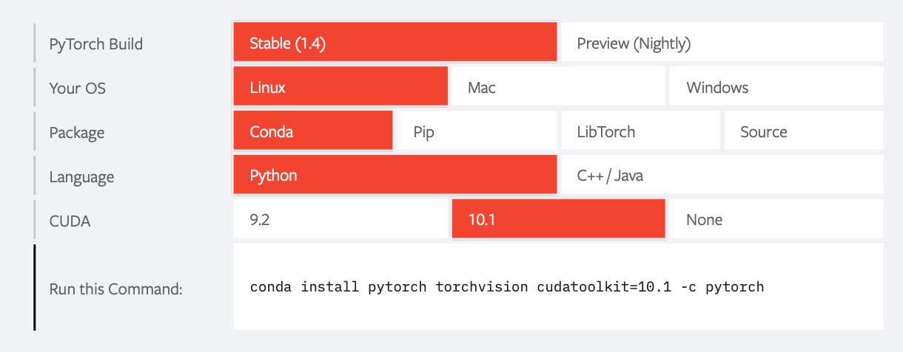
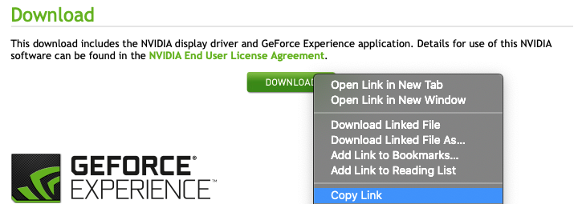

Sebastian Raschka, last updated: 02/12/2020

# PyTorch Installation Guide/Help for Enabling GPU Support

Here are some summarized steps for enabling GPU support for PyTorch. Note that I do not
recommend doing this on a laptop since it can lead to overheating issues if you train
deep neural networks on a mobile GPU. 

In case you have a desktop computer with a modern NVIDIA GPU, you can use these instructions
for setting up the GPU version of PyTorch. However, later I will you also show alternative
ways for using GPUs via free cloud services.

## Scenario A: Installing PyTorch if you already have your graphic card configured

As I mentioned in class, PyTorch already brings its own CUDA & cuDNN binaries, so installing them seperately will not be necessary (unless you compile PyTorch from source, but this is usually neither
necessary nor recommended).

You can check whether your NVIDIA graphic card drivers are properly installed by running

    nvidia-smi

in the command line. If everything works correctly, you should see something like this:

```
sraschka@gpu03:~$ nvidia-smi
Wed Feb 12 21:52:11 2020       
+-----------------------------------------------------------------------------+
| NVIDIA-SMI 440.33.01    Driver Version: 440.33.01    CUDA Version: 10.2     |
|-------------------------------+----------------------+----------------------+
| GPU  Name        Persistence-M| Bus-Id        Disp.A | Volatile Uncorr. ECC |
| Fan  Temp  Perf  Pwr:Usage/Cap|         Memory-Usage | GPU-Util  Compute M. |
|===============================+======================+======================|
|   0  GeForce RTX 208...  Off  | 00000000:1A:00.0 Off |                  N/A |
| 26%   46C    P0    72W / 250W |      0MiB / 11019MiB |      1%      Default |
+-------------------------------+----------------------+----------------------+
|   1  GeForce RTX 208...  Off  | 00000000:1B:00.0 Off |                  N/A |
| 29%   39C    P0    24W / 250W |      0MiB / 11019MiB |      0%      Default |
+-------------------------------+----------------------+----------------------+
|   2  GeForce RTX 208...  Off  | 00000000:3D:00.0 Off |                  N/A |
| 33%   58C    P2   236W / 250W |   5630MiB / 11019MiB |     31%      Default |
+-------------------------------+----------------------+----------------------+
|   3  GeForce RTX 208...  Off  | 00000000:3E:00.0 Off |                  N/A |
| 38%   62C    P2    72W / 250W |   5630MiB / 11019MiB |      0%      Default |
+-------------------------------+----------------------+----------------------+
|   4  GeForce RTX 208...  Off  | 00000000:88:00.0 Off |                  N/A |
| 45%   69C    P2    71W / 250W |   5630MiB / 11019MiB |      0%      Default |
+-------------------------------+----------------------+----------------------+
|   5  GeForce RTX 208...  Off  | 00000000:89:00.0 Off |                  N/A |
| 43%   68C    P2    96W / 250W |   5630MiB / 11019MiB |      0%      Default |
+-------------------------------+----------------------+----------------------+
|   6  GeForce RTX 208...  Off  | 00000000:B1:00.0 Off |                  N/A |
| 31%   50C    P2    59W / 250W |   1728MiB / 11019MiB |      0%      Default |
+-------------------------------+----------------------+----------------------+
|   7  GeForce RTX 208...  Off  | 00000000:B2:00.0 Off |                  N/A |
| 38%   64C    P2   212W / 250W |   6268MiB / 11019MiB |     44%      Default |
+-------------------------------+----------------------+----------------------+
```

In this case, there are 8 GPUs in this computer (ID 0 - 7 in the left column). Both the "Memory-Usage"
and "GPU-Util" are good indicators for finding out whether the GPU is currently used or not. Here, the 
3rd and 8th GPU seem to be used.

If the `nvidia-smi` command does not work on your machine, please move forward to the next section, which 
will help you setting it up. Again, please note that your machine will require a NVIDIA GPU for this.

If the `nvidia-smi` command already worked, you
can install PyTorch by selecting the appropriate installer from https://pytorch.org. For example,



Then, after installing PyTorch, you can verify CUDA support by executing the following
code in Python:

    import torch
    torch.cuda.is_available()

(It should return `True`.)

## Scenario B: If you are setting up a new environment

This section goes through the basic steps for setting up a fresh OS installation (i.e., **Ubuntu 18.04** in this example) for PyTorch with CUDA support. (For more details, please see: https://sebastianraschka.com/pdf/books/dlb/appendix_cloud-computing.pdf)


### Step 1: Updating existing packages

Update your existing packages via

    sudo apt-get update
    sudo apt-get upgrade

### Step 2: Install basic system packages

```bash
sudo apt-get install -y build-essential \
g++ gfortran git libfreetype6-dev libxft-dev \
libncurses-dev libopenblas-dev libblas-dev \
liblapack-dev libatlas-base-dev \
linux-headers-generic linux-image-extra-virtual \
zlib1g-dev libcurl3-dev
```

### Step 3: Install NVIDIA drivers (Part 1)

Check what graphics card you have via 

    lspci -nnk | grep -i

Then, get the latest graphics card driver from http://www.nvidia.com/Download/index.aspx:

1) select your graphics card from the menu and click on "Search". For example,


2) on the next page, click "Download"   

3) a new page will load, which contains another "Download" button: right-click on that button and select "copy link":




4) Then, download the driver via the link copied above via `wget`. E.g.,

    wget http://us.download.nvidia.com/XFree86/Linux-x86_64/440.59/NVIDIA-Linux-x86_64-440.59.run

5) After downloading, run the installer via

    bash NVIDIA-Linux-x86_64-440.59.run

and follow the on-screen instructions.

### Step 4: Install NVIDIA drivers (Part 2)

After downloading and installing the NVIDIA drivers (part 1), we need to blacklist the default Linux graphics card driver (called `noveau`, which is a reverse-engineered open-source version of the NVIDIA driver). 

Use the following to open (or create) the config file:

    sudo vi /etc/modprobe.d/blacklist-nouveau.conf

Enter the following information:

    blacklist nouveau
    options nouveau modeset=0

and then save and close the file.

Finally, we need to update the "inital RAM file system" by executing the following:

    sudo update-initramfs -u

### Step 5: Install Miniconda

You can skip this step if you have Miniconda already installed.

    wget https://repo.continuum.io/miniconda/Miniconda3-latest-Linux-x86_64.sh
    sudo bash Miniconda3-latest-Linux-x86_64.sh

(Follow the installation instructions shown on your screen.)

### Step 7: Install PyTorch

See the section at the top of *this document* entitled "Scenaria A: Installing PyTorch if you already have your graphic card configured."

---

- For more details, please see: https://sebastianraschka.com/pdf/books/dlb/appendix_cloud-computing.pdf

---

### Additional tips

Sometimes, it may be helpful to reboot the computer. Often, this can solve various problems with GPU configurations.

In case you have troubles with the PyTorch installation, for example, if the following code returns `False`

    import torch
    torch.cuda.is_available()

It may also be that your NVIDIA GPU is incompatible with newer versions of CUDA. In this case, uninstall PyTorch again and install it with an older version of CUDA. For example,

    conda install pytorch torchvision cudatoolkit=9.2 -c pytorch

PyTorch versions with older CUDA libraries are usually listed in the installer menu as well: https://pytorch.org